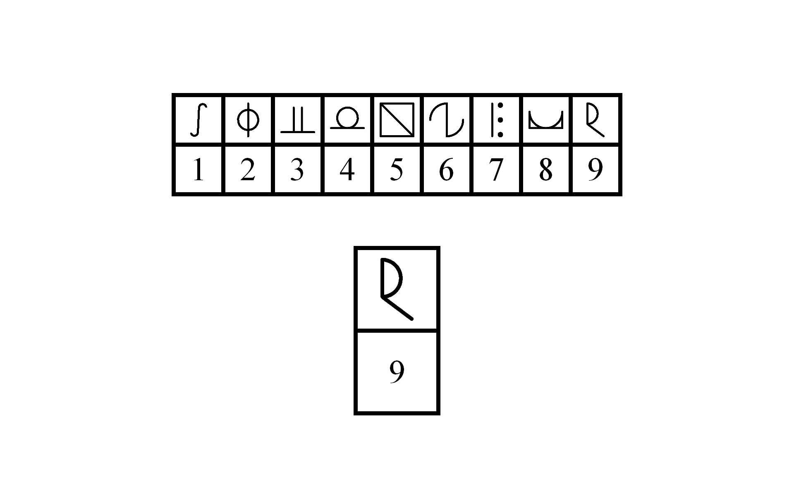

# mSDMT (modified SDMT)

The mSDMT files are written in NBS Presentation (R). When running them on Windows 10 we had issues when running them on Presentation versions higher than 19 (i.e., Presentation crashing during the paradigm).

## Running the mSDMT

1. adjust the paths in the script (see potential improvements #1)
2. Open the `MS-tDCS.exp` file to run the different conditions

- `Lerndurchgang`/`Lerndurchgang2.sce`: A learning phase for the participants to get used to the task for the first session (without a suffix) and the second session (with `2` suffix).
- `t1_MS-tDCS_ver1.2.sce`/`t2_MS-tDCS_ver1.2.sce`: The main task for the first session (with `t1` prefix) and second session (with `t2` prefix).

3. All four scripts need you to chose a version in the beginning (insert "ver1" or "ver2" after starting the script). This determines whether keybindings are 'm' indicates coherence and 'y' indicates incoherence or vice versa. ver1: 'm'=coherence, 'y'=incoherence; ver2: 'm'=incoherence, 'y'=coherence. (This was done to accomodate a German keyboard, note that an English keyboard has the 'y' and 'z' keys switched.)

## Quitting the task

The task can be quit any time using `CTRL + ALT + Escape`

## Potential improvements

1. Change the file-path representation to something more readable and useful (i.e., relative paths instead of full paths, using variables instead of a hard-coded path)
2. add item specific IDs to the log file so you can track the performance of individual items
3. Instructions have to be changed if the task is used in a different language (currently only in German)
